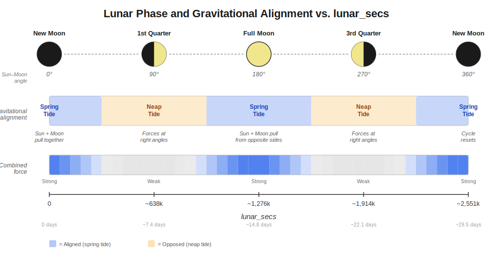
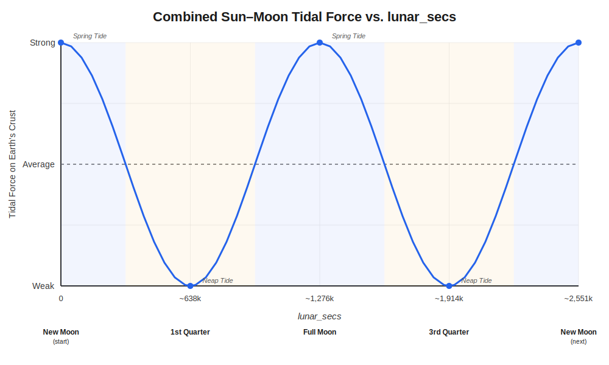

# Lunation and the `lunar_secs` Metric

## What Is Lunation?

A **lunation** is the period from one new moon to the next --- approximately 29.53 days (the synodic month). This is an established astronomical concept, unlike solaration which is custom. However, the way we use it here has a specific purpose: encoding the **combined gravitational relationship** between the Sun, Moon, and Earth at the moment of an earthquake.

## What Is `lunar_secs`?

`lunar_secs` is the **number of elapsed seconds** between the preceding new moon and the moment of an earthquake event.

```
lunar_secs = event_time - preceding_new_moon  (in seconds)
```

- **Minimum value**: 0 (event occurs exactly at a new moon)
- **Maximum value**: ~2,551,443 (~29.53 days, just before the next new moon)

### A Concrete Example

| | Date/Time (UTC) |
|---|---|
| New moon | 2024-03-10 09:00:28 |
| Earthquake event | 2024-03-25 12:00:00 |
| Next new moon | 2024-04-08 18:20:59 |

```
lunar_secs = 2024-03-25 12:00:00  minus  2024-03-10 09:00:28
           = 1,310,972 seconds
           ≈ 15.2 days into the lunation
```

This places the event just past the midpoint of the lunation --- near the full moon.

## The Dual Nature of `lunar_secs`

This is the key insight: a single `lunar_secs` value simultaneously encodes **two** pieces of information.

### 1. Lunar Orbital Position

As the Moon orbits Earth (~27.3 day sidereal period), `lunar_secs` tracks how far the Moon has traveled since the start of the lunation. The Moon completes slightly more than one full orbit per lunation because Earth is also moving around the Sun.

### 2. Sun-Moon Gravitational Alignment (Lunar Phase)

Because the lunation is defined by the **synodic** month (new moon to new moon), the elapsed time directly corresponds to the **phase angle** between the Sun and Moon as seen from Earth. This phase determines whether solar and lunar gravity act **together** or in **opposition**.

The graphic below shows both relationships:



### Gravitational Alignment by Phase

| lunar_secs (approx.) | Phase | Sun-Moon Angle | Gravitational Effect |
|---|---|---|---|
| 0 | New Moon | 0° (same direction) | **Maximum alignment** --- Sun and Moon pull together; strongest combined tidal force (spring tide) |
| ~638,000 (~7.4 days) | First Quarter | 90° (perpendicular) | **Opposition** --- gravitational forces act at right angles; weakest combined force (neap tide) |
| ~1,276,000 (~14.8 days) | Full Moon | 180° (opposite sides) | **Alignment restored** --- Sun and Moon pull from opposite sides; strong combined tidal force (spring tide) |
| ~1,914,000 (~22.1 days) | Third Quarter | 270° (perpendicular) | **Opposition** --- forces at right angles again; neap tide |
| ~2,551,000 (~29.5 days) | Next New Moon | 360°/0° | Cycle resets |

## Why Both Pieces of Information Matter

For seismic research, we care about gravitational stress on Earth's crust. The Moon is the dominant tidal force (about twice the Sun's tidal effect), but the **Sun-Moon alignment** modulates the total force significantly:

- **Spring tides** (new moon and full moon): Combined tidal forces are ~46% stronger than average
- **Neap tides** (quarter moons): Combined tidal forces are ~46% weaker than average

Most people are familiar with **ocean tides** --- the visible rise and fall of sea levels caused by the Sun and Moon's gravitational pull. But the same forces also produce **earth tides** (also called body tides or solid earth tides), a lesser-known phenomenon where the Earth's crust itself deforms slightly --- rising and falling by up to ~30 cm twice daily. Ocean tides and earth tides share the same gravitational cause and follow the same spring/neap cycle described above. The difference is what's moving: water in one case, rock in the other. For seismic research, earth tides are the directly relevant mechanism, as these subtle but periodic stresses act on fault systems worldwide.

A single `lunar_secs` value captures this full picture without needing separate fields for "lunar position" and "lunar phase" --- they are mathematically the same measurement when anchored to the new moon.

### The Gravitational Force Curve



Notice the **two peaks per lunation** --- one at new moon (solar and lunar forces aligned in the same direction) and one at full moon (forces aligned in opposite directions, but still additive for tidal stretching). The troughs at the quarter moons represent minimum combined tidal stress.

## How It Is Calculated in Code

The calculation mirrors the approach used for `solar_secs`, but with new moon events instead of solstices:

1. **Build a new moon table** --- Skyfield's `almanac.moon_phases()` identifies every new moon from 1948 through 2050
2. **Find the preceding new moon** --- Binary search locates the most recent new moon before the event
3. **Compute the difference** --- Subtraction gives elapsed seconds

```python
preceding_new_moon = new_moon_table[idx]    # most recent new moon
delta = event_at - preceding_new_moon
lunar_secs = int(delta.total_seconds())
```

Using Skyfield's ephemeris ensures sub-minute accuracy for new moon times, which is critical for correctly placing events within the lunation cycle.
