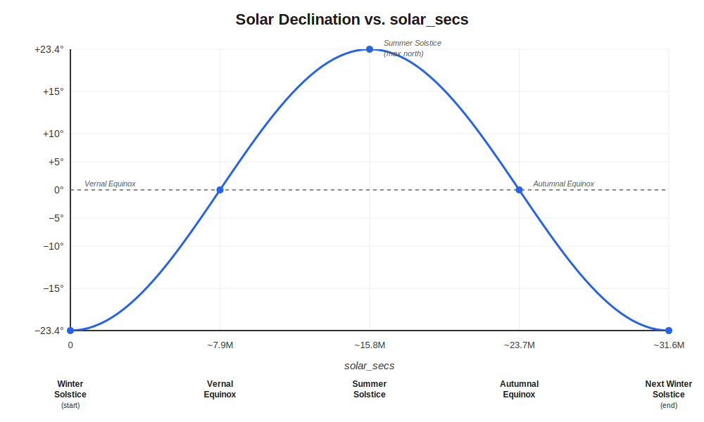

# Solaration and the `solar_secs` Metric

## What Is Solaration?

The conventional calendar (January 1 through December 31) is a civil construct. Its boundaries don't align with any meaningful astronomical event. **Solaration** replaces this with a year defined by the **winter solstice** (also called the December solstice or hibernal solstice) --- the moment each year when the Sun reaches its southernmost declination.

A single *solaration* is the period from one winter solstice to the next, typically ~365.24 days. The **solaration year** is labeled by the calendar year that follows the starting solstice. For example, solaration year **2024** runs from the December 2023 solstice to the December 2024 solstice.

### Why the Winter Solstice?

The winter solstice marks the point in Earth's orbit where the Sun's gravitational pull is directed at its most extreme southern angle relative to the equatorial plane. From this anchor point, the Sun's declination sweeps northward to the summer solstice, then returns southward --- a complete cycle of changing gravitational geometry. Starting the year here provides a clean, astronomically meaningful origin for tracking Earth's orbital position.

## What Is `solar_secs`?

`solar_secs` is simply the **number of elapsed seconds** between the preceding winter solstice and the moment of an earthquake event.

```
solar_secs = event_time - preceding_winter_solstice  (in seconds)
```

- **Minimum value**: 0 (event occurs exactly at the winter solstice)
- **Maximum value**: ~31,556,900 (just before the next winter solstice; varies slightly year to year)

### A Concrete Example

| | Date/Time (UTC) |
|---|---|
| Winter solstice 2023 | 2023-12-22 03:27:19 |
| Earthquake event | 2024-03-20 12:00:00 |
| Winter solstice 2024 | 2024-12-21 09:20:30 |

```
solar_secs = 2024-03-20 12:00:00  minus  2023-12-22 03:27:19
           = 7,742,561 seconds
           ≈ 89.6 days into the solaration year
```

This tells us the event occurred roughly one-quarter of the way through the solaration year --- near the vernal equinox, when the Sun's declination is crossing the equator heading north.

## How `solar_secs` Maps to Solar Declination

The Sun's declination follows a smooth, roughly sinusoidal curve over each solaration. The graphic below illustrates this relationship.



### Reading the Curve

| solar_secs (approx.) | Orbital Position | Sun's Declination | Gravitational Geometry |
|---|---|---|---|
| 0 | Winter solstice | -23.4° (max south) | Pull directed farthest south of equator |
| ~7,900,000 (~91 days) | Vernal equinox | 0° | Pull aligned with equatorial plane |
| ~15,800,000 (~183 days) | Summer solstice | +23.4° (max north) | Pull directed farthest north of equator |
| ~23,700,000 (~274 days) | Autumnal equinox | 0° | Pull aligned with equatorial plane |
| ~31,560,000 (~365 days) | Next winter solstice | -23.4° (max south) | Cycle resets |

## Why This Matters for Seismic Research

The Sun's gravitational force on Earth is enormous, but it is the **changing angle** of that force that is relevant to seismic studies. As the Sun's declination shifts through the year:

- The tidal stress on Earth's crust changes in direction and magnitude
- Different latitude bands experience varying gravitational geometry
- These stresses are slight compared to tectonic forces, but they are **periodic and measurable**

By encoding each earthquake's position within the solaration as a simple integer (`solar_secs`), we gain a metric that directly corresponds to the Sun's declination angle --- free from the arbitrary offsets of civil calendars, daylight saving changes, or leap-year irregularities.

### Comparison: Calendar Date vs. `solar_secs`

| Approach | Anchored to astronomy? | Uniform across years? | Directly encodes declination? |
|---|---|---|---|
| Calendar date (Jan 1 origin) | No | Roughly (leap years vary) | No |
| Day-of-year (1-365) | No | No (leap years shift) | No |
| `solar_secs` (solstice origin) | Yes | Yes (each solaration is one full cycle) | Yes |

## How It Is Calculated in Code

The calculation uses the Skyfield library to compute precise winter solstice times from astronomical ephemeris data, then measures elapsed seconds:

1. **Build a solstice table** --- Skyfield's `almanac.seasons()` identifies every December solstice from 1948 through 2050
2. **Find the preceding solstice** --- For a given event time, a binary search locates the most recent winter solstice before that event
3. **Compute the difference** --- Simple subtraction gives the elapsed seconds

```python
preceding_solstice = solstice_table[idx]       # most recent winter solstice
delta = event_at - preceding_solstice
solar_secs = int(delta.total_seconds())
solaration_year = preceding_solstice.year + 1  # label for the solaration
```

The precision of Skyfield's ephemeris calculations means `solar_secs` is accurate to within a few seconds of the true astronomical position.

